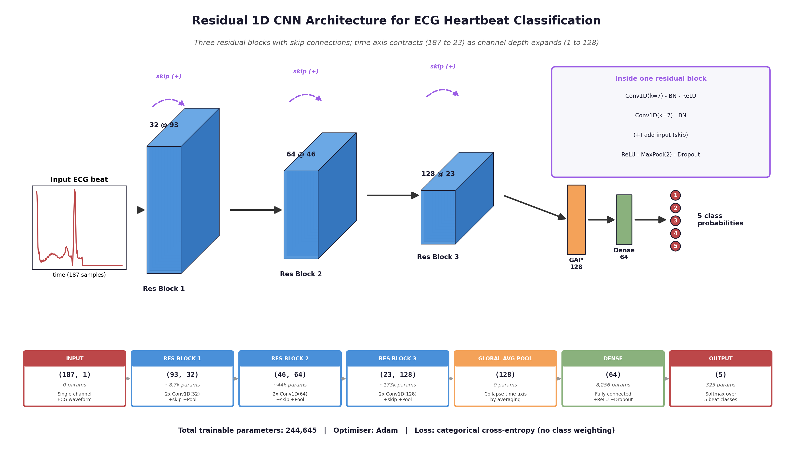
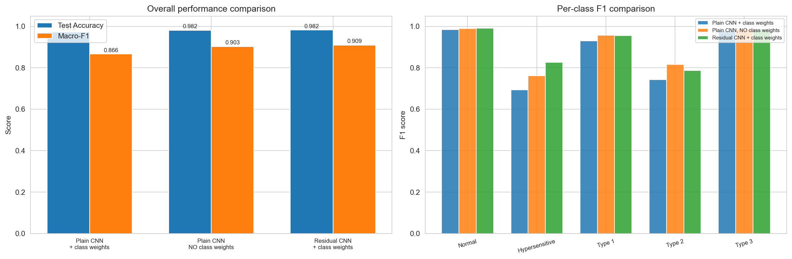
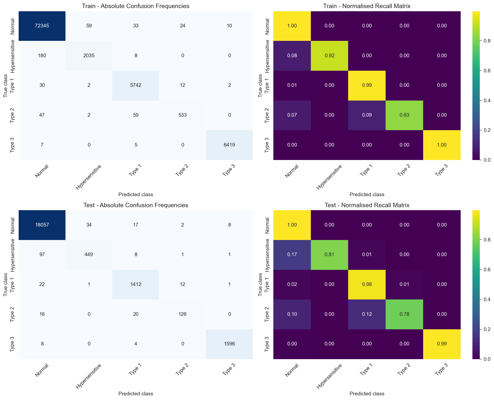
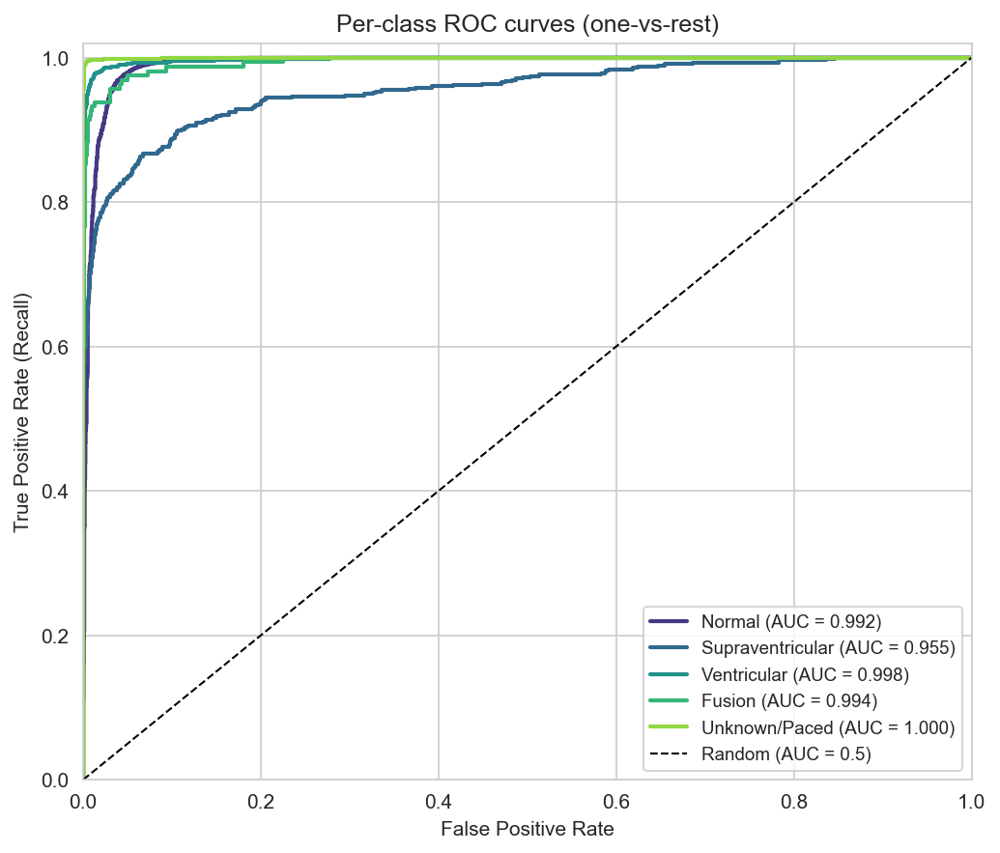
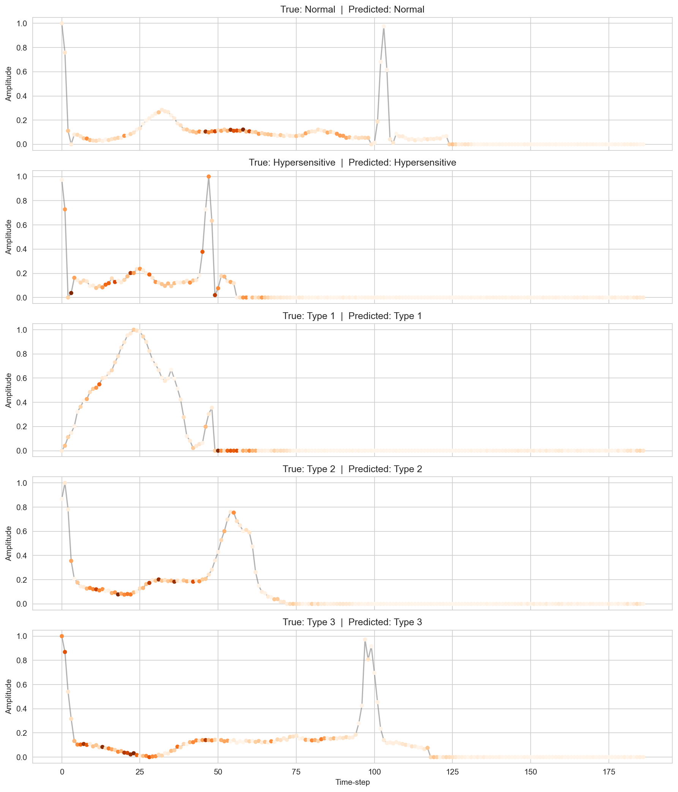

# ECG Heartbeat Classification with a Residual 1D CNN

A deep learning model that classifies single ECG heartbeats into 5 arrhythmia categories. It was trained on about 109k beats from the MIT-BIH Arrhythmia Database. The final residual 1D CNN reaches **98.8% test accuracy and 0.93 macro-F1**, compared with 0.65 macro-F1 for a logistic regression baseline.



## Results (held-out test set, 21,892 beats)

| Class (AAMI) | Notebook label | Precision | Recall | F1 |
|---|---|---|---|---|
| N: Normal | Normal | 0.992 | 0.997 | 0.994 |
| S: Supraventricular ectopic | Hypersensitive | 0.928 | 0.808 | 0.863 |
| V: Ventricular ectopic | Type 1 | 0.966 | 0.975 | 0.971 |
| F: Fusion | Type 2 | 0.894 | 0.778 | 0.832 |
| Q: Unknown / paced | Type 3 | 0.994 | 0.993 | 0.993 |
| **Overall** | | | **Accuracy 0.988** | **Macro-F1 0.931** |

The dataset is heavily imbalanced (about 83% Normal), so **macro-F1 is the headline metric**. A model that always predicts "Normal" would still score about 83% accuracy.

### Ablation: architecture × class weighting

| Variant | Test accuracy | Macro-F1 |
|---|---|---|
| Plain CNN + class weights | 0.972 | 0.866 |
| Plain CNN, no class weights | 0.982 | 0.903 |
| Residual CNN + class weights | 0.982 | 0.909 |
| **Residual CNN, no class weights (final)** | **0.990** | **0.936** |
| *Baseline: Logistic Regression* | *0.914* | *0.646* |



## Method

1. **Data:** 187-sample heartbeats, already normalised to [0, 1]. Each beat is reshaped to `(187, 1)` for Conv1D.
2. **Hyperparameter search:** random search over 12 configurations, scored with stratified 5-fold cross-validation. The best configuration is kernel size 7, dropout 0.3, learning rate 1e-3 and batch size 64. It scores a CV accuracy of 96.4% ± 0.4% (95% CI 96.1–96.8%).
3. **Architectures:** a plain CNN (three Conv–BN–ReLU–Pool blocks, 32→64→128 filters, then global average pooling; 82k parameters) and a residual CNN (245k parameters).
4. **Class imbalance:** square-root-tempered inverse-frequency class weights are compared against no weighting.
5. **Training:** Adam with early stopping (patience 6) and ReduceLROnPlateau, using a stratified 90/10 train/validation split.
6. **Diagnostics:** confusion matrices, per-class ROC and precision-recall curves, a t-SNE projection of the learned features and gradient-based saliency maps.

| Confusion matrices | ROC curves | Saliency |
|---|---|---|
|  |  |  |

## Run it

1. Download `mitbih_train.csv` and `mitbih_test.csv` from the [ECG Heartbeat Categorization Dataset on Kaggle](https://www.kaggle.com/datasets/shayanfazeli/heartbeat) and place them in `data/`.
2. Install the dependencies and open the notebook:

```bash
pip install -r requirements.txt
jupyter notebook Training-ANN.ipynb
```

## Project structure

```
├── Training-ANN.ipynb           # full pipeline: EDA → CV search → ablation → final model → evaluation
├── make_architecture_resnet.py  # generates the architecture diagram
├── final_metrics.json           # all final train/test metrics
├── final_history.json           # training curves
├── fig_*.png                    # figures
└── data/                        # put the MIT-BIH CSVs here (not included)
```

## Tech stack

Python · TensorFlow / Keras · scikit-learn · NumPy · pandas · matplotlib

## Author

**Arush Kumar Vishwakarma**, [GitHub](https://github.com/Arush70). Originally built for ECMM422 Machine Learning coursework.
